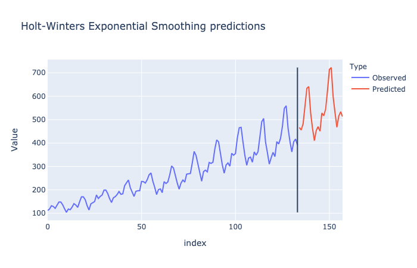
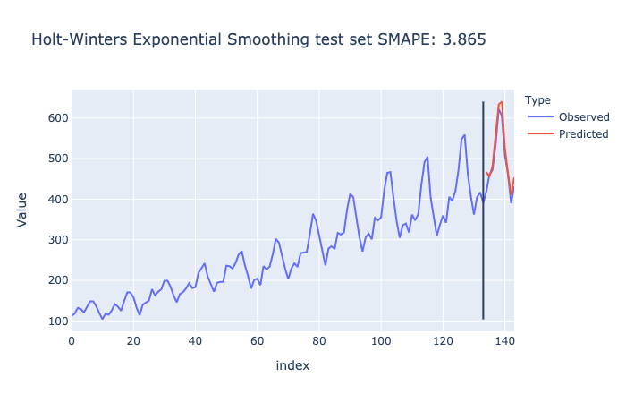
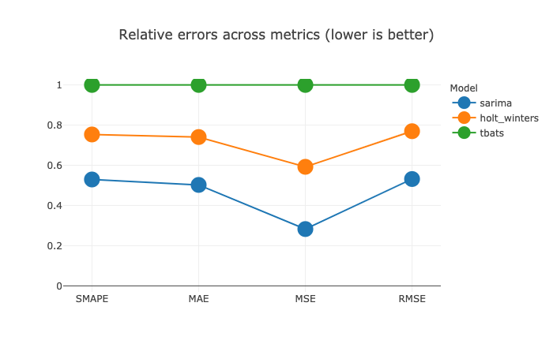

**This is a work in progress**


```
augur /ˈȯ-gər/

NOUN
1. (in ancient Rome) a religious official who observed and interpreted 
   omens and signs to help guide the making of public decisions
2. any prophet or soothsayer

VERB
3. to predict (some future event), as from signs or omens
```

# Time Series Augur
[](https://opensource.org/licenses/MIT)
[](https://www.python.org/downloads/release/python-360/)

## What is tsaugur?
`tsaugur` is a low-code Python package for time series forecasting. It allows data scientists to fit, tune, compare, evaluate, ensemble  and visualize a range of models quickly and with just a few lines of code.  

`tsaugur` is basically a unified interface to a number of Python libraries for time series prediction, such as `prophet`, `statsmodels`, `tbats`, `pmdarima`, `pydlm` and more, plus some ensembling and plotting features.

## Quickstart
Load example data and split into train and test set:
```python
from tsaugur.datasets import load_dataset

data = load_dataset("air_passengers")
y_train = data["passengers"][:134]
y_test = data["passengers"][134:]
```
### Fit and plot a single model
Check available models:
```python
from tsaugur.models import print_available_models

print_available_models()
```
```buildoutcfg
Model             Description                                           Exogeneous variables
--------------------------------------------------------------------------------------------
holt_winters      Holt-Winters Exponential Smoothing                    no
sarima            Seasonal Auto-Regression Integrated Moving Average    yes
fourier_sarima    Auto-Regression Integrated Moving Average             yes
                  with seasonality captured by Fourier terms
tbats             Trigonometric seasonality, Box-Cox transformation,    no
                  ARMA errors, Trend and Seasonal components
bdlm              Bayesian Dynamic Linear Model                         yes
prophet           Facebook's Prophet model                              yes
```
Fit and tune a Holt-Winters Exponential Smoothing model:
```python
from tsaugur.models import create_model

model = create_model("holt_winters")
model.fit(y_train, period=12)
```
Make and plot predictions for the next 24 periods:
```python
preds = model.predict(horizon=24)
model.plot_predict(horizon=24)
```


Score and plot the model against the test set:
```python
score = model.score(y_test, metric="smape")
model.plot_score(y_test, metric="smape")
```

### Compare different models
Tabulate error metrics for different models:
```python
from tsaugur.models import compare_models

comp = compare_models(["holt_winters", "sarima", "tbats"],
                      y_train, y_test, period=12)
comp.tabulate()
```
```buildoutcfg
                 smape        mae         mse       rmse
sarima        2.715588  12.837482  249.713469  15.802325
holt_winters  3.864753  18.928886  523.328546  22.876375
tbats         5.129382  25.555115  883.309555  29.720524
```
Plot model comparison:
```python
comp.plot()
```

### Ensemble different models
in progress


## Author
This project is authored and maintained by [Michał Oleszak](https://michaloleszak.github.io/).

## License
MIT License

© 2020 Michał Oleszak

Permission is hereby granted, free of charge, to any person obtaining a copy
of this software and associated documentation files (the "Software"), to deal
in the Software without restriction, including without limitation the rights
to use, copy, modify, merge, publish, distribute, sublicense, and/or sell
copies of the Software, and to permit persons to whom the Software is
furnished to do so, subject to the following conditions:

The above copyright notice and this permission notice shall be included in all
copies or substantial portions of the Software.

THE SOFTWARE IS PROVIDED "AS IS", WITHOUT WARRANTY OF ANY KIND, EXPRESS OR
IMPLIED, INCLUDING BUT NOT LIMITED TO THE WARRANTIES OF MERCHANTABILITY,
FITNESS FOR A PARTICULAR PURPOSE AND NONINFRINGEMENT. IN NO EVENT SHALL THE
AUTHORS OR COPYRIGHT HOLDERS BE LIABLE FOR ANY CLAIM, DAMAGES OR OTHER
LIABILITY, WHETHER IN AN ACTION OF CONTRACT, TORT OR OTHERWISE, ARISING FROM,
OUT OF OR IN CONNECTION WITH THE SOFTWARE OR THE USE OR OTHER DEALINGS IN THE
SOFTWARE. 

